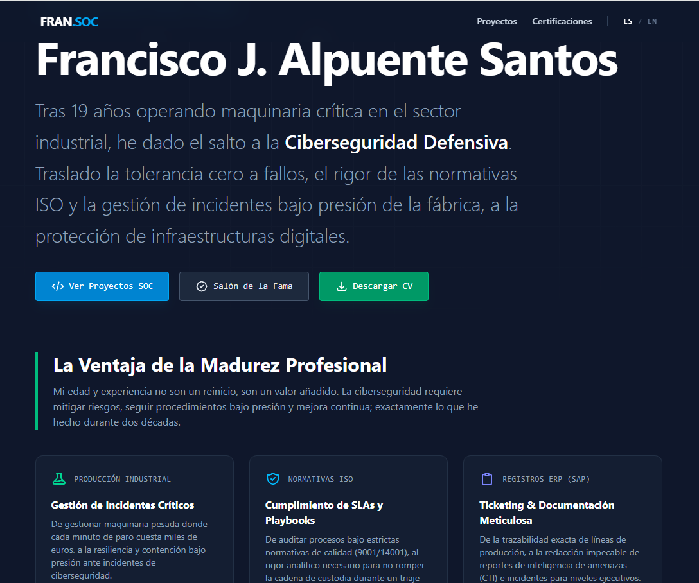

# 🛡️ Ciberseguridad & Blue Team | Portfolio Técnico

Código fuente de la infraestructura web y hub de documentación técnica de un servidor, **Francisco J. Alpuente**. 

Este repositorio contiene el despliegue de un portfolio profesional estático, diseñado con una arquitectura nativa bilingüe (EN/ES) y optimizado para ofrecer la máxima velocidad con una **superficie de ataque mínima** (SSG sin bases de datos expuestas).

## 🏗️ Arquitectura y Stack Tecnológico

* **Framework Core:** [Astro](https://astro.build/) (Static Site Generation para rendimiento y seguridad extrema).
* **Estilos:** [Tailwind CSS](https://tailwindcss.com/) (Diseño responsivo, oscuro y de estética corporativa/terminal).
* **Internacionalización (i18n):** Sistema de enrutamiento dinámico mediante estructura de directorios y renderizado condicional.
* **Componentes Dinámicos:** Destrucción de caché (Cache-Busting) mediante Vanilla JS para forzar la actualización de métricas en tiempo real.

## 🔬 Proyectos y Laboratorios Documentados

Esta web actúa como centro de operaciones para mostrar desarrollos y arquitecturas de ciberseguridad defensiva:

* **[OpenSentry (SOAR Autónomo)](https://github.com/xXMurallaXx/OpenSentry-SOAR):** Plataforma backend en Python para orquestación, enriquecimiento de inteligencia (CTI) y respuesta automatizada.
* **[Security Coach (Enterprise EDR)](https://github.com/xXMurallaXx/security-coach):** Extensión de navegador basada en Manifest V3 para interceptación de amenazas, protección Zero-Trust y DLP, con telemetría integrada en Wazuh SIEM.
* **[Enterprise SOC Lab](https://github.com/xXMurallaXx/Enterprise-SOC-Lab):** Infraestructura virtualizada inter-VLAN para Threat Hunting corporativo, correlación XDR y hardening de Active Directory.

## 📜 Certificaciones y Trayectoria

Además de la documentación técnica, la plataforma centraliza el ecosistema de credenciales y la trayectoria formativa:

* **Salón de la Fama:** Validaciones oficiales Enterprise (Fortinet FCA/FCF, CyberArk PAM, Fundamentos GRC) y métricas de entrenamiento continuo (TryHackMe).
* **Curriculum Vitae:** Sistema de descarga directa del CV actualizado, sirviendo el documento correspondiente (Inglés o Español) según la navegación del usuario.

## 📬 Contacto e Identidad Digital

Puedes visualizar la infraestructura operativa en producción, auditar los proyectos o descargar mi CV directamente en el portal:

🌐 **Web en Producción:** https://fran-alpuente.vercel.app/
💼 **Contacta conmigo en LinkedIn:** https://www.linkedin.com/in/francisco-jose-alpuente-santos-/

---
*Diseñado bajo los principios de "Secure by Design" e Integración Continua.*